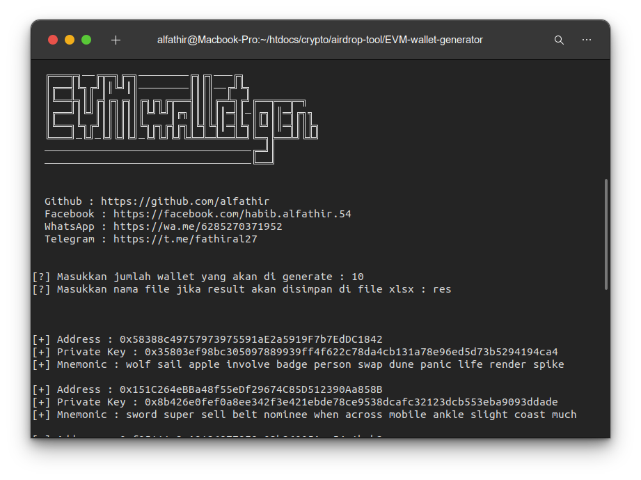

# EVM Wallet Generator

## Overview

Wallet Generator for Ethereum Virtual Machine like:

- Ethereum
- Binance Smart Chain
- Fantom
- Matic (Polygon)
- Etc.

## Installation

- Install NodeJS from [here](https://nodejs.org).
- Run `git clone https://github.com/alfathir/evm-wallet-generator` to clone this repository.
- Run `cd evm-wallet-generator` to enter tool directory.
- Run `npm install` to installing dependencies.
- Run `npm run gen` to start tool.

## License

#### Mit
